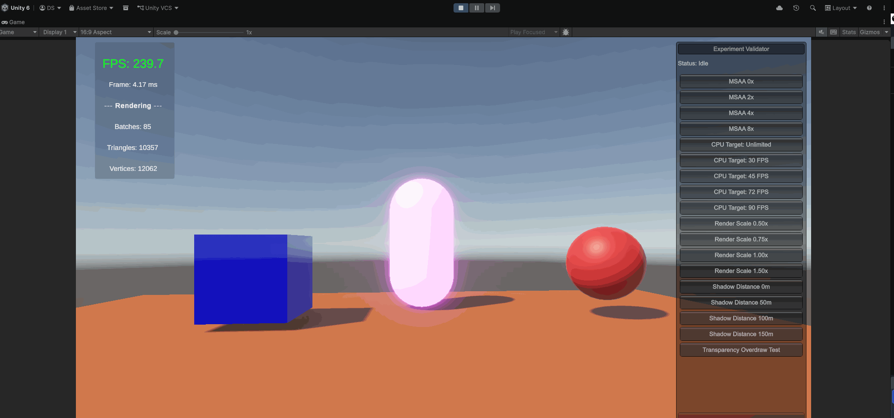

# XR Performance Lab

> A modular, interface-driven performance testing system built in Unity 6 (URP) for XR applications.  
> Designed to run reproducible experiments that isolate and measure the impact of individual rendering variables.


---



---

## What This Is

XR applications run under strict real-time constraints — 72, 80, or 90+ FPS depending on the device. Hitting those targets requires understanding exactly how each rendering decision affects the CPU, GPU, and render thread.

XR Performance Lab is a controlled environment for studying those interactions. It runs structured experiments, holds each configuration for a measurable window, then restores the original state — giving you clean, comparable data for every variable you test.

---

## System Architecture

The project is built around a clean layered architecture with full separation of concerns.

```
Core/
├── Interfaces/          → IExperiment, IExperimentRunner, IExperimentRegistry
├── Services/            → ExperimentRunner, ExperimentRegistry
└── Utilities/           → XRLabBootstrap, PlayModeValidator

Experiments/
├── MSAA/                → MSAAExperiment
├── CPUThrottle/         → CPUThrottleExperiment
├── RenderScale/         → RenderScaleExperiment
├── Shadows/             → ShadowExperiment
└── Transparency/        → TransparencyExperiment

Metrics/                 → PerformanceMetrics, metric providers
UI/
├── Panels/              → ExperimentControlPanelController, LabMetricsPanelController
└── Views/               → BasicExperimentControlView, BasicLabMetricsView, ILabPanelView
```

**Key design decisions:**

- Every experiment implements `IExperiment` — `Setup()` → `Run()` → `Teardown()`
- `Teardown()` is guaranteed to run via `try/finally` even if `Run()` throws
- The UI layer only talks to `IExperimentRunner` and `IExperimentRegistry` — never to experiments directly
- `XRLabBootstrap` is the single wiring point — no static singletons anywhere
- New experiments can be added without modifying any existing code

---

## Experiment Runner Flow

```
Bootstrap.Awake()
    └── Registers all experiments into IExperimentRegistry

PlayModeValidator / UI
    └── Calls IExperimentRunner.RunExperiment(experiment)
            └── Setup()   → saves current Unity state
            └── Run()     → applies the test configuration
            └── Hold      → waits N seconds for metrics to stabilize
            └── Teardown()→ restores original state unconditionally
            └── OnExperimentCompleted event fired
```

---

## Experiments

| Experiment | Variable Tested | Values |
|---|---|---|
| `MSAAExperiment` | `QualitySettings.antiAliasing` | 0x, 2x, 4x, 8x |
| `CPUThrottleExperiment` | `Application.targetFrameRate` | Unlimited, 30, 45, 72, 90 FPS |
| `RenderScaleExperiment` | `XRSettings.renderViewportScale` | 0.50x, 0.75x, 1.00x, 1.50x |
| `ShadowExperiment` | `QualitySettings.shadowDistance` | 0m, 50m, 100m, 150m |
| `TransparencyExperiment` | Transparent object overdraw | Off / Max overdraw |

18 experiment instances registered and runnable from Play Mode.

---

## Metrics Overlay

Live metrics displayed during every experiment run:

- FPS
- Frame time (ms)
- Batch count
- Triangle count
- Vertex count

---

## Getting Started

**Requirements**
- Unity 6 (6000.x)
- Universal Render Pipeline (URP)
- OpenXR or XR Plugin Management (for device builds)

**Run in Editor**
1. Clone the repo
2. Open in Unity 6
3. Open `Assets/XRPerformanceLab/Scenes/` and load the lab scene
4. Press Play
5. Use the **Experiment Validator** panel (top-right) to select and run any experiment
6. Watch metrics update in the overlay (top-left)

**Hold duration** (how long each experiment stays active before restoring) is configurable on the `ExperimentRunner` component. Default: 3 seconds.

---

## Adding a New Experiment

1. Create a class implementing `IExperiment`
2. Implement `Setup()`, `Run()`, `Teardown()`, `Id`, and `DisplayName`
3. Register an instance in `XRLabBootstrap.Awake()`
4. No other files need modification

```csharp
public sealed class MyExperiment : IExperiment
{
    public string Id => "my-experiment";
    public string DisplayName => "My Experiment";

    private int _originalValue;

    public void Setup()   => _originalValue = QualitySettings.someValue;
    public void Run()     => QualitySettings.someValue = _testValue;
    public void Teardown()=> QualitySettings.someValue = _originalValue;
}
```

---

## Technical Focus Areas

- CPU vs GPU bottleneck identification
- Render thread behavior under XR constraints
- Fill rate and render scale impact on standalone VR
- Shadow rendering cost in forward+ URP
- Transparency and fragment shader overdraw
- Batching, draw calls, and GPU instancing analysis
- Reproducible profiling methodology in Unity

---

## Roadmap

- [ ] FPS history graph (line chart reacting to experiment runs)
- [ ] GPU frame time via `ProfilerRecorder`
- [ ] JSON results export per experiment run
- [ ] PCVR vs Quest standalone comparison mode
- [ ] GitHub Actions CI build check

---

## Author

**Diego Santander Sepúlveda**  
XR Developer · Unity Developer · Game Developer

[](https://www.linkedin.com/in/diego-santander-sep%C3%BAlveda-748423341/)
[](https://github.com/vdkaaa)
